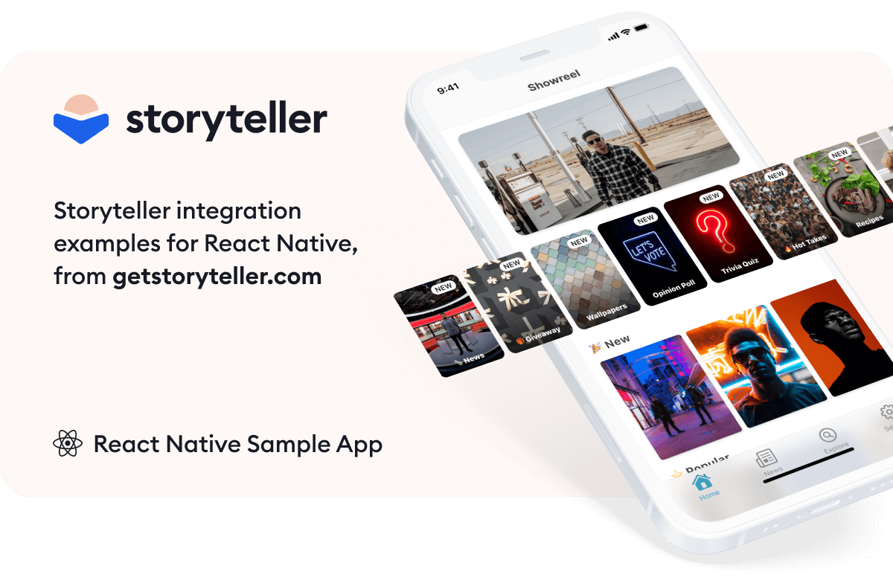

# Storyteller React Native Sample App

  &nbsp;&nbsp;&nbsp;
  

## SDK Installation

### Install with NPM

`npm install @getstoryteller/react-native-storyteller-sdk`

### Install with Yarn

`yarn add @getstoryteller/react-native-storyteller-sdk`

## Documentation

All of the documentation for our React Native SDK is [available on our website](https://www.getstoryteller.com/documentation/react-native/quickstart)

## Sample Apps

This repo contains the following sample applications:

- [Simple Project](https://github.com/getstoryteller/storyteller-sample-react-native/tree/main/SimpleProject)
- [Advanced Project](https://github.com/getstoryteller/storyteller-sample-react-native/tree/main/AdvancedProject)

## Other Platforms

Storyteller is also available for [iOS](https://github.com/getstoryteller/storyteller-sample-ios), [Android](https://github.com/getstoryteller/storyteller-sample-android) and [Web](https://github.com/getstoryteller/storyteller-sample-web).

## Need Help?

We're always available at [support@getstoryteller.com](mailto:support@getstoryteller.com?Subject=Web%20Sample%20App) to provide help and assistance with integrating the Storyteller SDK into your React Native application.